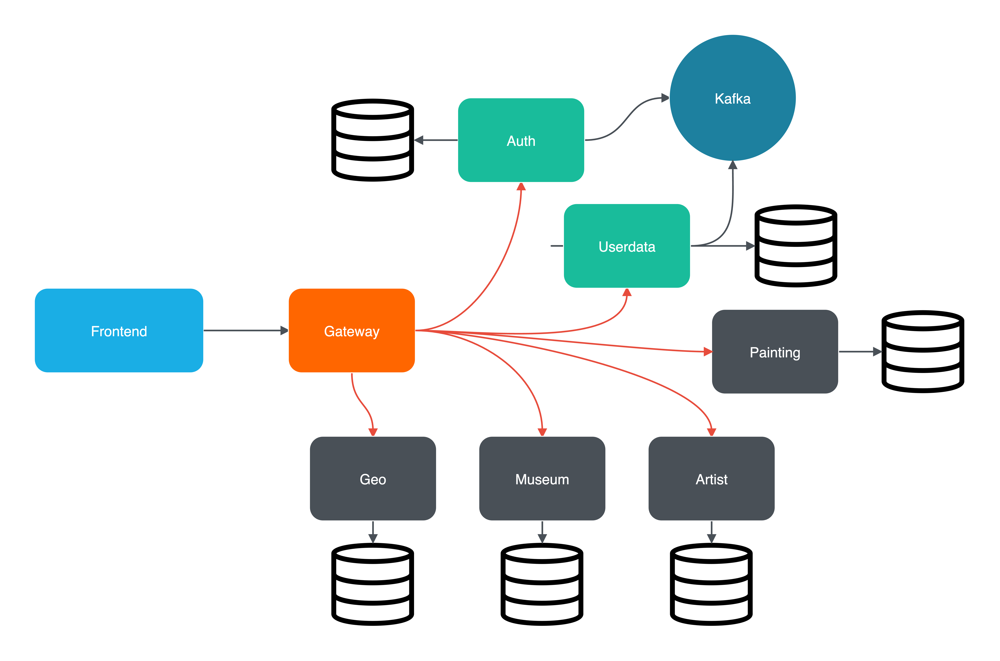

#  Rococo
**Дипломная работа по курсу QA.GURU Advanced**
<hr>

## О проекте
+ Rococo - web-приложение для хранения картин, художников и музеев


### Технологии, использованные в Rococo
- [Spring Authorization Server](https://spring.io/projects/spring-authorization-server)
- [Spring OAuth 2.0 Resource Server](https://docs.spring.io/spring-security/reference/servlet/oauth2/resource-server/index.html)
- [Spring data JPA](https://spring.io/projects/spring-data-jpa)
- [Spring Web](https://docs.spring.io/spring-framework/docs/current/reference/html/web.html#spring-web)
- [Spring actuator](https://docs.spring.io/spring-boot/docs/current/reference/html/actuator.html)
- [Apache Kafka](https://developer.confluent.io/quickstart/kafka-docker/)
- [Docker](https://www.docker.com/resources/what-container/)
- [Docker-compose](https://docs.docker.com/compose/)
- [Postgres](https://www.postgresql.org/about/)
- [Svelte](https://svelte.dev/)
- [Jakarta Bean Validation](https://beanvalidation.org/)
- [JUnit 5 (Extensions, Resolvers, etc)](https://junit.org/junit5/docs/current/user-guide/)
- [Retrofit 2](https://square.github.io/retrofit/)
- [Allure](https://docs.qameta.io/allure/)
- [Selenide](https://selenide.org/)
- [Selenoid & Selenoid-UI](https://aerokube.com/selenoid/latest/)
- [Allure-docker-service](https://github.com/fescobar/allure-docker-service)
- [Java 17](https://www.oracle.com/java/technologies/javase/jdk17-archive-downloads.html)
- [Gradle 7.6](https://docs.gradle.org/7.6/release-notes.html)

### Микросервисы в Rococo
+ [Rococo-auth]() - *Сервис авторизации*
+ [Rococo-gateway]() - *Api-шлюз*
+ [Rococo-userdata]() - *Сервис для работы с профилями пользователей*
+ [Rococo-geo]() - *Сервис для работы с геоданными*
+ [Rococo-museum]() - *Сервис для работы с музеями*
+ [Rococo-painting]() - *Сервис для работы с картинами*
+ [Rococo-artist]() - *Сервис для работы с художниками*

## Схема микросервисов Rococo


<hr>

### Минимальные предусловия для работы с проектом Rococo

#### 0. Если у вас ОС Windows

Во-первых, необходимо использовать **bash terminal**, а не powershell.
Во-вторых, для запуска фронтенда локально необходимо использовать команду
`npm run build:windows`, если не работает стандартная команда `npm run dev`

#### 1. Установить docker (Если не установлен)

[Установка на Windows](https://docs.docker.com/desktop/install/windows-install/)

[Установка на Mac](https://docs.docker.com/desktop/install/mac-install/) (Для ARM и Intel разные пакеты)

[Установка на Linux](https://docs.docker.com/desktop/install/linux-install/)

После установки и запуска docker daemon необходимо убедиться в работе команд docker, например `docker -v`:

```posh
michailklimov@Michails-MacBook-Air ~ % docker -v
Docker version 20.10.14, build a224086
```

#### 2. Установить Java версии 17 или новее. Это необходимо, т.к. проект не поддерживает версии <17

Версию установленной Java необходимо проверить командой `java -version`

```posh
michailklimov@Michails-MacBook-Air ~ % java -version
openjdk version "19.0.1" 2022-10-18
OpenJDK Runtime Environment Homebrew (build 19.0.1)
```

#### 3. Установить пакетый менеджер для сборки front-end npm

[Инструкция](https://docs.npmjs.com/downloading-and-installing-node-js-and-npm).
Рекомендованная версия Node.js - 18.13.0 (LTS)

#### 4. Создать volume для сохранения данных из БД в docker на вашем компьютере

```posh
docker volume create rococo
```

#### 5. Запустить БД, zookeeper и kafka используя bash
В терминале выполнить
```posh
michailklimov@Michails-MacBook-Air rococo %  bash localenv.sh 
```

#### 6. Установить одну из программ для визуальной работы с Postgres

Например, DBeaver.

#### 7. Подключиться к БД postgres (host: localhost, port: 5432, user: postgres, pass: secret, database name: postgres) и создать пустые БД микросервисов

```sql
create
    database "rococo-userdata" with owner postgres;
create
    database "rococo-auth" with owner postgres;
create
    database "rococo-museum" with owner postgres;   
create
    database "rococo-painting" with owner postgres;
create
    database "rococo-artist" with owner postgres;
create
    database "rococo-geo" with owner postgres;
```
<hr>

# Запуск Rococo локальное в IDE:

#### 1. В IDE выполнить bash скрипт:

```posh
michailklimov@Michails-MacBook-Air rococo %  bash localenv.sh 
```

#### 2. Прописать run конфигурацию для всех сервисов rococo-* - Active profiles local

Для этого зайти в меню Run -> Edit Configurations -> выбрать main класс -> указать Active profiles: local
[Инструкция](https://stackoverflow.com/questions/39738901/how-do-i-activate-a-spring-boot-profile-when-running-from-intellij).

#### 3 Запустить сервис Rococo-auth c помощью gradle или командой Run в IDE:

- Запустить сервис auth

```posh
michailklimov@Michails-MacBook-Air rococo % cd rococo-auth
michailklimov@Michails-MacBook-Air rococo-auth % gradle bootRun --args='--spring.profiles.active=local'
```

Или просто перейдя к main-классу приложения RococoAuthApplication выбрать run в IDEA (предварительно удостовериться что
выполнен предыдущий пункт)

#### 4  Запустить в любой последовательности другие сервисы: rococo-geo, rococo-userdata, rococo-gateway, rococo-museum, rococo-artist, rococo-painting

Rococo при запуске локально будет работать для вас по адресу http://localhost:3000

<hr>

# Запуск Rococo в докере:

#### 1. Создать бесплатную учетную запись на https://hub.docker.com/ (если отсутствует)

#### 2. Создать в настройках своей учетной записи access_token

[Инструкция](https://docs.docker.com/docker-hub/access-tokens/).

#### 3. Выполнить docker login с созданным access_token (в инструкции это описано)

#### 4. Прописать в etc/hosts элиас для Docker-имени

- frontend:  127.0.0.1 client.rococo.dc,
- auth:      127.0.0.1 auth.rococo.dc
- gateway:   127.0.0.1 api.rococo.dc

```posh
michailklimov@Michails-MacBook-Air rococo % vi /etc/hosts
```

```posh
##
# Host Database
#
# localhost is used to configure the loopback interface
# when the system is booting.  Do not change this entry.
##
127.0.0.1       localhost
127.0.0.1       client.rococo.dc
127.0.0.1       auth.rococo.dc
127.0.0.1       api.rococo.dc
```

#### 5. Перейти в корневой каталог проекта

```posh
michailklimov@Michails-MacBook-Air rococo % cd rococo
```

#### 6. Запустить все сервисы:

```posh
michailklimov@Michails-MacBook-Air  rococo % bash docker-compose-dev.sh
```

Rococo при запуске в докере будет работать для вас по адресу http://client.rococo.dc

<hr>

# Запуск тестов локально:

#### 1. Перейти в корневой каталог проекта

```posh
michailklimov@Michails-MacBook-Air rococo % cd rococo
```

#### 2. Сервисы успешно запущены с помощью

```posh
michailklimov@Michails-MacBook-Air rococo %  bash localenv.sh 
```

#### 3. Запускаем тесты

```posh
michailklimov@Michails-MacBook-Air rococo %  ./gradlew :rococo-tests:clean test
```

#### 4. После прогона тестов выполняем запуск Allure отчета

```posh
michailklimov@Michails-MacBook-Air rococo %  ./gradlew :rococo-tests:allureServe --host localhost --port 9999
```

<hr>

# Запуск тестов в Docker network изолированно Rococo в докере:

#### 1. Перейти в корневой каталог проекта

```posh
michailklimov@Michails-MacBook-Air rococo % cd rococo
```

#### 2. Запустить все сервисы и тесты:

```posh
michailklimov@Michails-MacBook-Air rococo % bash docker-compose-tests.sh
```

#### 3. Selenoid UI доступен по адресу: http://localhost:9090/

#### 4. Allure доступен по адресу: http://localhost:5050/allure-docker-service/projects/rococo-tests/reports/latest/index.html